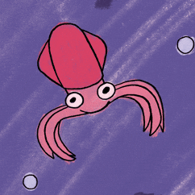

  

<h1 align="center">👋 hey, i’m amaan</h1>

  
  
  

 

## 👩‍💻 About Me

🌍 i grew up between pakistan and northern virginia  

🎓 i am currently in high school  

⚙️ i am usually working on an engineering project or website  

🎨 interested in fashion, visual design, and gaming  

🤼 outside of that, i do wrestling and debate  

📁 this github is where the code, documentation, and unfinished experiments end up  

### right now

- 🔭 documenting my gravity battery project and working on **Belief**, a probabilistic programming language
- 👯 open to collaborating with people seriously building a startup
- 🌱 learning more about electronics, embedded systems, and PCB design
- 💬 ask me about my projects or anything in my repositories

## 💻 Things I Work With

**Languages**

**Web Development**

**Engineering + Systems**

**Creative + Interactive**

